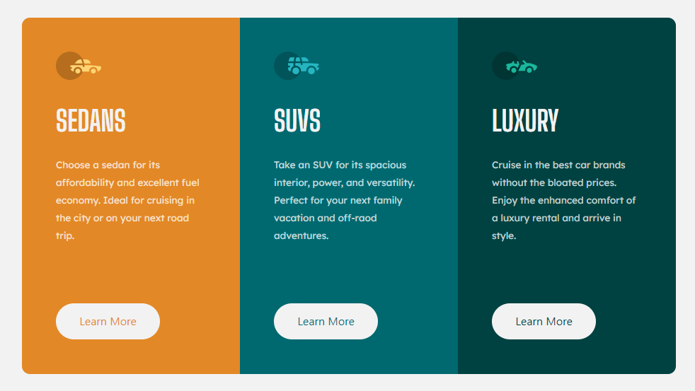

# THREE COLUMN PREVIEW COMPONENT
- [Frontend Mentor](https://www.frontendmentor.io/) Challenge
- Uses React
- I'm passing colors through props into each card component. While I can change the color of the text on the buttons using inline styles with props, I unfortunately can't change the hover state with inline styles. So I had to use ".card:nth-of-type(n) button" in the Card.module.css file to change the color of the button's text.
- [Live Site](https://dapper-druid-437e2f.netlify.app/)
---
